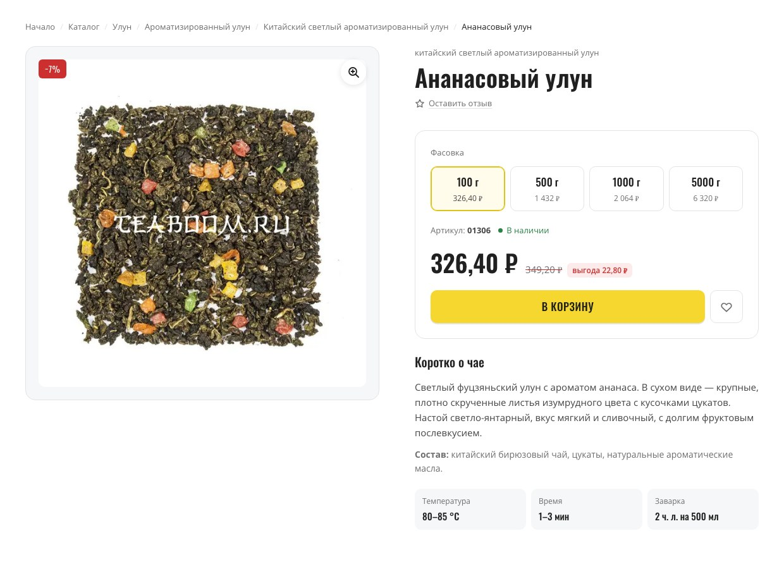
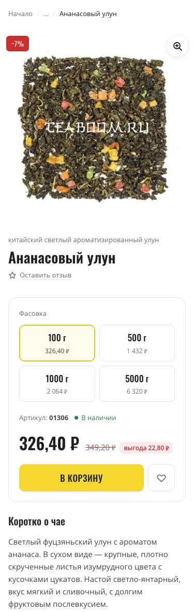

<h1 align="center">Карточка товара Teaboom.ru</h1>

<p align="center">
  Вёрстка верхней части карточки товара интернет-магазина «Чайный Бум»
</p>

<p align="center">
  
  
  
  
</p>

<p align="center">
  <a href="https://luckx16.github.io/teaboom_test/">Демо</a>
  ·
  <a href="https://teaboom.ru/product/ananasovij-ulun">Товар на сайте</a>
</p>

<p align="center">
  
</p>

<p align="center">
  
</p>

## Запуск

Собранный CSS лежит в репозитории, поэтому для просмотра ничего устанавливать не нужно:

```bash
open index.html
```

Для работы со стилями:

```bash
npm install
npm run dev     # sass --watch, пересборка при сохранении
npm run build   # минифицированная сборка
```

Единственная зависимость — `sass`.

## Структура

```
index.html              разметка карточки
styles/
├── main.scss           точка входа, только @use
├── _normalize.scss     сброс браузерных стилей
├── _variables.scss     CSS-переменные: цвета, отступы, радиусы, шрифты
├── _fonts.scss         @font-face
├── _globals.scss       body, типографика, .page, .visually-hidden
├── helpers/
│   └── _media.scss     брейкпоинты и миксин from()
└── blocks/             breadcrumbs, product, variants, price, button,
                        summary, dialog
css/main.css            результат сборки
js/product-card.js      переключение фасовок, избранное, диалоги
img/                    фото товара: WebP + JPEG, по три размера
fonts/                  Open Sans и Oswald, локально
favicon/
```

Стили разложены по блокам: один файл — один блок, имена классов по БЭМ.
В `helpers/` лежит только то, что не выводит CSS, поэтому его можно
подключать в любом количестве файлов без дублирования в сборке.

## Что реализовано

Переключение фасовки меняет цену, старую цену, артикул, размер скидки и
подсвечивает выбранный вариант:

| Фасовка | Артикул | Цена | Старая цена | Скидка |
| ------- | ------- | ---- | ----------- | ------ |
| 100 г   | 01306   | 326,40 ₽ | 349,20 ₽ | −7% |
| 500 г   | 01307   | 1 432 ₽  | 1 646 ₽  | −13% |
| 1000 г  | 01308   | 2 064 ₽  | 2 592 ₽  | −20% |
| 5000 г  | 01309   | 6 320 ₽  | 8 710 ₽  | −27% |

Дополнительно: увеличение фото, избранное с сохранением выбора между
визитами, форма отзыва с оценкой. Корзина и бэкенд не подключены —
кнопка «В корзину» показывает состояние «Добавлено» и возвращается
в исходное.

Данные фасовок лежат в `data-`атрибутах радиокнопок, а не в JS-массиве:
цены и артикулы остаются в разметке, и при переносе на шаблонизатор
меняется только способ её генерации, а скрипт трогать не нужно.

## Адаптивность

Вёрстка mobile-first, брейкпоинты в `rem` — если пользователь увеличил
шрифт в настройках браузера, раскладка переключится раньше.

| Ширина | Раскладка |
| ------ | --------- |
| до 768 | одна колонка, фото от края до края экрана, хлебные крошки схлопнуты до «Начало … Товар» |
| от 768 | две колонки, фото и шапка карточки липкие при прокрутке |
| от 1200 | увеличенные отступы и типографика |

Проверено на 375, 768 и 1440 px.

## Доступность

- фасовки — обычные `radio` в `fieldset`, работают с клавиатуры без JS
- состояние цены обновляется в контейнере с `aria-live="polite"`
- избранное сообщает состояние через `aria-pressed`, подпись меняется
- контраст текста проверен по WCAG AA
- анимации отключаются при `prefers-reduced-motion`

## Производительность

Lighthouse (desktop), локальный сервер:

| Категория | Оценка |
| --------- | ------ |
| Performance | 100 |
| Accessibility | 100 |
| Best Practices | 100 |
| SEO | 100 |

LCP 0,5 с · CLS 0 · TBT 0 мс

Что для этого сделано:

- фото в WebP с запасным JPEG через `<picture>`, три размера и `srcset`
- `width` и `height` на изображениях — нет сдвигов макета при загрузке
- `fetchpriority="high"` на главном фото, `loading="lazy"` на фото в лайтбоксе
- шрифты локальные, без обращений к Google Fonts: два сабсета на семейство
  с `unicode-range`, `font-display: swap`, предзагрузка нужных начертаний
- знака ₽ нет ни в одном стандартном сабсете Google Fonts, поэтому из
  `Oswald latin-ext` вырезан один глиф — файл на 852 байта вместо 19 КБ

## Поддержка браузеров

Chrome, Firefox, Safari, Edge — актуальные версии.

Для Safari старше 15.4, где нет `<dialog>`, предусмотрен запасной путь:
окна открываются через атрибут `open`, закрытие по Esc навешивается
скриптом. Без него диалоги отображались бы на странице постоянно.

## SEO

- семантические теги, один `h1`
- микроразметка `schema.org/Product` с ценой, наличием и артикулом:
  цена в `<meta itemprop="price">` обновляется вместе с фасовкой
- микроразметка `schema.org/BreadcrumbList` на хлебных крошках
- Open Graph для корректного превью при отправке ссылки
